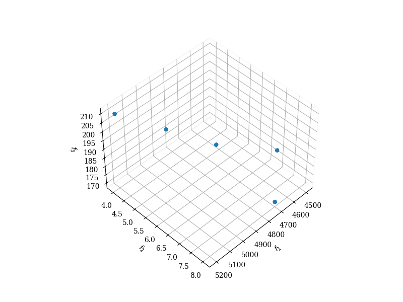

# Text2MOO
Using LLM generate config to call MOEAs to solve real life multi-objective problems

## Features

- **Text Input Processing**: Accept natural language descriptions of optimization requirements and raw data
- **LLM Integration**: Use LLM to parse user input and generate structured NSGA-II configurations
- **NSGA-II Optimization**: Execute multi-objective optimization using NSGA-II algorithm
- **Pareto Solutions**: Return Pareto-optimal solutions for multi-objective problems

## Project Structure

- `prompts/` - System prompts for LLM data formatting and config generation
- `pipeline/` - Text2MOO pipelines connecting LLM with optimization algorithm
- `moea/` - MOEAs algorithm implementation

## Current Implementation

The system currently supports:
- Converting text descriptions into NSGA-II problem configurations
- Processing raw data through LLM for structured formatting
- Running NSGA-II optimization with customizable parameters
- Handling multiple objectives and constraints

## Test Result
###Test Data:
```json
{
    "user_query": "I need to optimize my supply chain for cost, delivery time, and carbon footprint. I have 5 potential suppliers, 3 transportation modes, and 4 warehouse locations. The goal is to minimize cost and delivery time while also reducing the carbon footprint as much as possible.",
    "data_snippet": {
        "suppliers": [
            {
                "supplier_id": "S1",
                "cost": 5000,
                "delivery_time_days": 5,
                "carbon_footprint_kg": 200
            },
            {
                "supplier_id": "S2",
                "cost": 4500,
                "delivery_time_days": 7,
                "carbon_footprint_kg": 180
            },
            {
                "supplier_id": "S3",
                "cost": 4800,
                "delivery_time_days": 6,
                "carbon_footprint_kg": 190
            },
            {
                "supplier_id": "S4",
                "cost": 5200,
                "delivery_time_days": 4,
                "carbon_footprint_kg": 210
            },
            {
                "supplier_id": "S5",
                "cost": 4700,
                "delivery_time_days": 8,
                "carbon_footprint_kg": 170
            }
        ],
        "transportation_modes": [
            {
                "mode_id": "T1",
                "cost_per_km": 0.5,
                "speed_km_per_h": 60,
                "carbon_footprint_kg_per_km": 0.3
            },
            {
                "mode_id": "T2",
                "cost_per_km": 0.7,
                "speed_km_per_h": 80,
                "carbon_footprint_kg_per_km": 0.4
            },
            {
                "mode_id": "T3",
                "cost_per_km": 0.6,
                "speed_km_per_h": 70,
                "carbon_footprint_kg_per_km": 0.35
            }
        ],
        "warehouse_locations": [
            {
                "warehouse_id": "W1",
                "distance_from_supplier_km": 100,
                "storage_cost_per_unit": 10
            },
            {
                "warehouse_id": "W2",
                "distance_from_supplier_km": 150,
                "storage_cost_per_unit": 8
            },
            {
                "warehouse_id": "W3",
                "distance_from_supplier_km": 200,
                "storage_cost_per_unit": 7
            },
            {
                "warehouse_id": "W4",
                "distance_from_supplier_km": 120,
                "storage_cost_per_unit": 9
            }
        ]
    }
}
```
### Result
```terminal
2025-06-19 18:32:28,556 - text2nsga2 - INFO - Formatting data...
2025-06-19 18:32:28,556 - text2nsga2 - INFO - Formatting data using qwen-plus...
2025-06-19 18:32:48,412 - text2nsga2 - INFO - Generating NSGA2Config...
2025-06-19 18:32:48,413 - text2nsga2 - INFO - Generating NSGA2Config using qwen-plus...
2025-06-19 18:33:02,499 - text2nsga2 - INFO - Objective:
{
    "cost": "sum_min",
    "delivery_time_days": "sum_min",
    "carbon_footprint_kg": "sum_min"
}
2025-06-19 18:33:02,500 - text2nsga2 - INFO - Constraints:
{
    "distance_from_supplier_km": {
        "type": "<=",
        "value": 500
    },
    "speed_km_per_h": {
        "type": ">=",
        "value": 40
    }
}
2025-06-19 18:33:02,501 - text2nsga2 - INFO - Setting up NSGA2Problem...
2025-06-19 18:33:02,504 - text2nsga2 - INFO - Initialize NSGA2 algorithm with pop_size=100, n_gen=50, constraint_penalty=1000000.0        
2025-06-19 18:33:02,505 - text2nsga2 - INFO - Running NSGA2...
==========================================================================================
n_gen  |  n_eval  | n_nds  |     cv_min    |     cv_avg    |      eps      |   indicator
==========================================================================================
     1 |       49 |     49 |  0.000000E+00 |  0.000000E+00 |             - |             -
WARNING: Mating could not produce the required number of (unique) offsprings!
     2 |       60 |     60 |  0.000000E+00 |  0.000000E+00 |  0.000000E+00 |             f
     3 |       60 |     60 |  0.000000E+00 |  0.000000E+00 |  0.000000E+00 |             f
2025-06-19 18:33:03,384 - text2nsga2 - INFO - Generate report...
Solution 1:
suppliers: S4
transportation_modes: T3
warehouse_locations: W1
total_cost: 5200.0
total_delivery_time_days: 4.0
total_carbon_footprint_kg: 210.0


Solution 2:
suppliers: S5
transportation_modes: T1
warehouse_locations: W2
total_cost: 4700.0
total_delivery_time_days: 8.0
total_carbon_footprint_kg: 170.0

...
```

